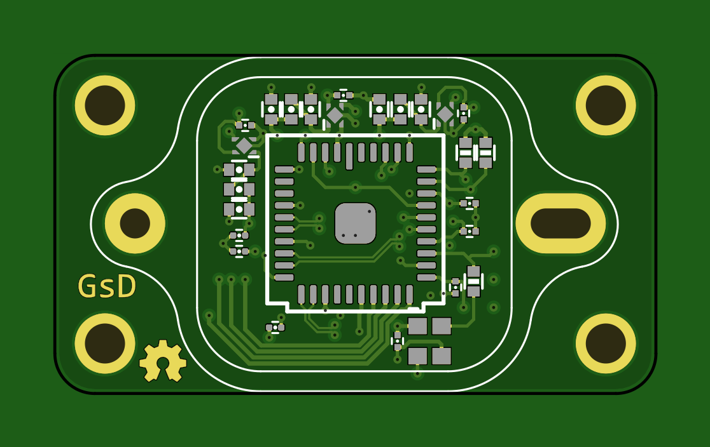
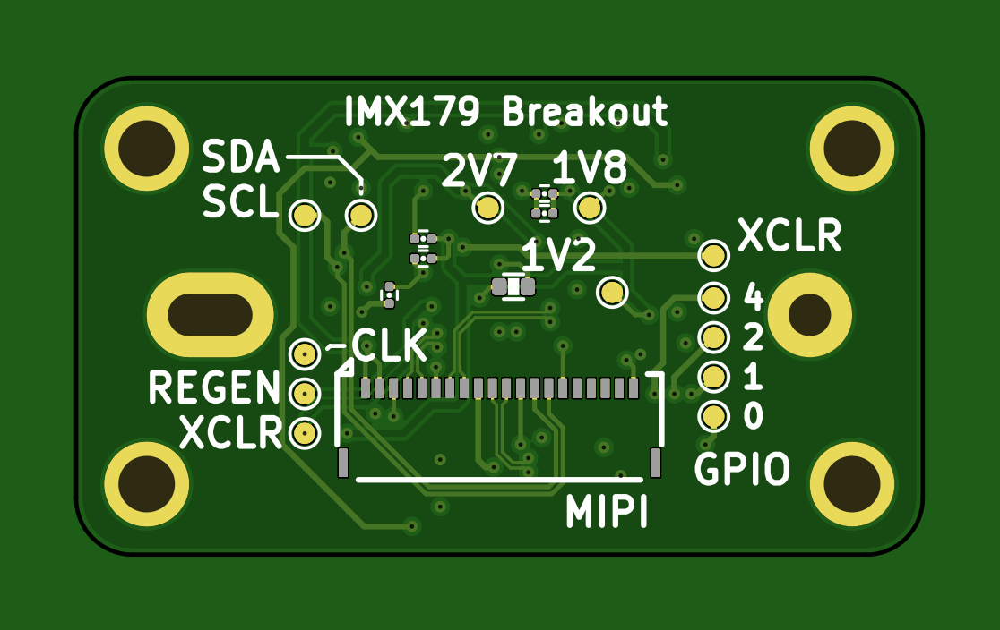

# Sony IMX179 Breakout

## A breakout for the Sony IMX179 8MP CMOS Sensor

## Hardware

* Sony IMX179 Sensor
* 1V2, 1V8, 2V5 LDO Voltage rails
* MEMS Oscillator
* 20 pin FFC connector to host system

